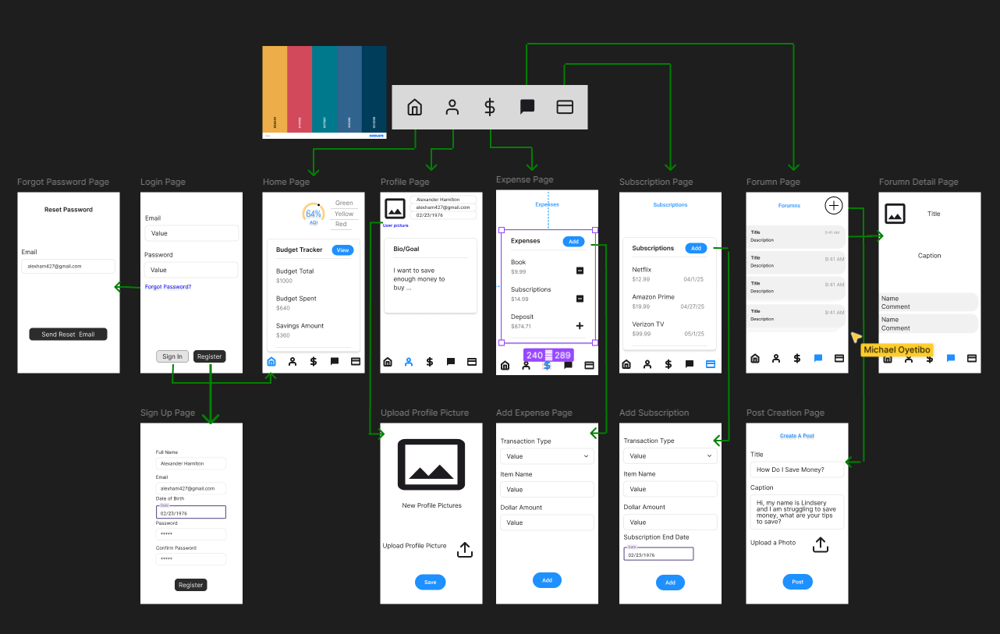

# Milestone 1 - Budguette (Unit 7)

## Table of Contents

1. [Overview](#Overview)
1. [Product Spec](#Product-Spec)
1. [Wireframes](#Wireframes)

## Overview

### Description

An all-in-one app that helps users track their spending, savings, investments, and gives personalized financial advice based on their habits. It integrates with bank accounts, bills, and other financial tools, offering monthly budgeting tips, investment growth insights, and community-driven forumn. It could include features like smart reminders for bill payments, automatic savings rules, and goal tracking for big purchases or debts.

### App Evaluation

[Evaluation of your app across the following attributes]
- **Category:** Finances, Lifestyle, Productivity
- **Mobile:** The app plans to implement camera feature to import finances. This app will have real-time forumn for users.
- **Story:** In troubling times, a lot of people find themselves struggling to maintain money. This causes issues with livelihoods and the ability to be successful. Budguette aims to address these challenges by offering an interactive platform that provides users with financial news, educational resources, budgeting tools, and community engagement features. 
- **Market:** Finances is a very large market as everyone is looking to save. The unique traits about the app is the community-driven forumns and the streak implementation to bring users back.
- **Habit:**  The goal is to add a daily incentive for users to come back to the app.
- **Scope:** A stripped down version of this idea has been built time again which is why the unique factors are important to implementation. This application will feature database, front-end, and back-end programming.

## Product Spec

### 1. User Features (Required and Optional)

**Required Features**

1. Login Page
2. Forget Password
3. Signup Page
4. Log Out Option
5. Profile Page
6. User can add/change phone number, email address, and username (once a week)
7. Home/Budget Page
8. Expenses stream flow on home page (Icon/Pic + Name + Price)
10. Progress Bar for Budget
11. Ability for User to enter their pay.
12. User ability to add and delete expenses, deposits (Budget Page), and subscriptions (subscription page),
13. Subscription Tracker
14. Help/FAQ/Tips User Forum Page (Shows User Profile, Titles, 
15. Forumn Create Post Option (Includes Title, Message, Ability to add pictures, post button)
16. Forumn Details Page (Shows all of the info from creation)
17. User can delete their own post
18. User can comment on posts
19. Calculate Spending (Weekly, Monthly, Yearly)
20. Calculate Savings (Weekly, Monthly, Yearly)
21. Calculate time to reach a User's goal 

**Optional Features**

1. Calculator
2. Sign-In Authentication
3. Payment Reminders
4. Calendar
5. Savings Page (with per interim goals)
6. Camera Option for tracking receipts
7. Currency Conversion
8. Ability to generate reports with trends of user
9. Settings Page
10. Moderated Forumn

### 2. Screen Archetypes

- Home Screen
  - User can view budget
  - User can view Expenses
- Login Screen
  - User Login
- Sign-Up Screen
  - User can create account
- Subscription Screen
  - User can track subscriptions
- Forumns Screen
  - User can create post
  - User can delete their post

### 3. Navigation

**Tab Navigation** (Tab to Screen)

* Home Page
* Subscription Page
* Forums Page
* Profile Page

**Flow Navigation** (Screen to Screen)

- Login Screen
  - => Home
- Sign-Up Screen
  - => Home
- Post Creation (Forumn) Page
  - => Forumn Page (After creating new post)

## Wireframes

Hand-drawn Wireframe  

 

Older Hand-drawn Wireframe  

 

 

### [BONUS] Digital Wireframes & Mockups
Our outdated Digital Wireframe  

 

Our Current Digital Wireframe  

### [BONUS] Interactive Prototype

 

# Milestone 2 - Build Sprint 1 (Unit 8)

## GitHub Project board

[Add screenshot of your Project Board with three milestones visible in
this section]

## Issue cards

- [Add screenshot of your Project Board with the issues that you've been working on for this unit's milestone] 
- [Add screenshot of your Project Board with the issues that you're working on in the **NEXT sprint**. It should include issues for next unit with assigned owners.] 

## Issues worked on this sprint

- List the issues you completed this sprint
- [Add giphy that shows current build progress for Milestone 2. Note: We will be looking for progression of work between Milestone 2 and 3. Make sure your giphys are not duplicated and clearly show the change from Sprint 1 to 2.]

 

# Milestone 3 - Build Sprint 2 (Unit 9)

## GitHub Project board

[Add screenshot of your Project Board with the updated status of issues for Milestone 3. Note that these should include the updated issues you worked on for this sprint and not be a duplicate of Milestone 2 Project board.] 

## Completed user stories

- List the completed user stories from this unit
- List any pending user stories / any user stories you decided to cut
from the original requirements

[Add video/gif of your current application that shows build progress]

## App Demo Video

- Embed the YouTube/Vimeo link of your Completed Demo Day prep video
